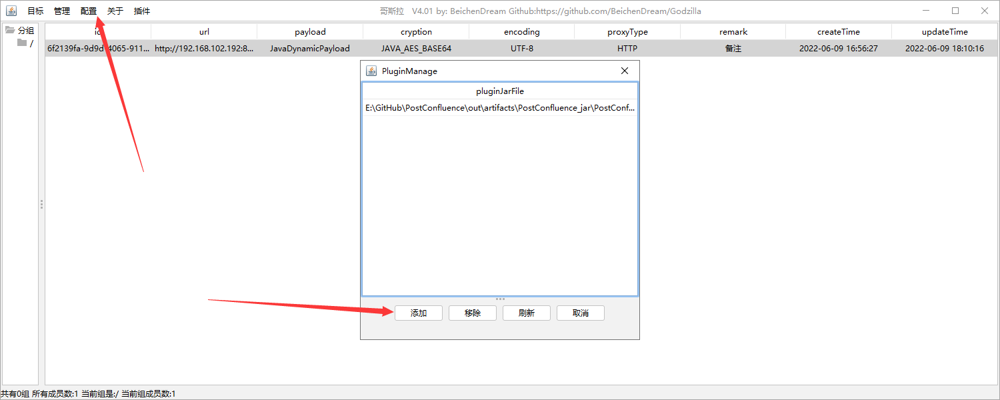
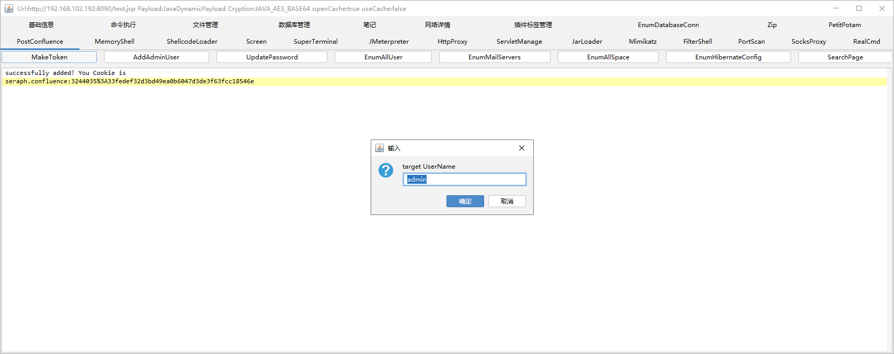
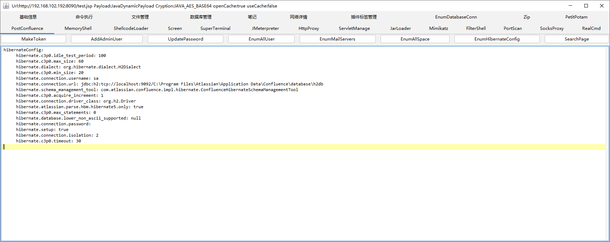
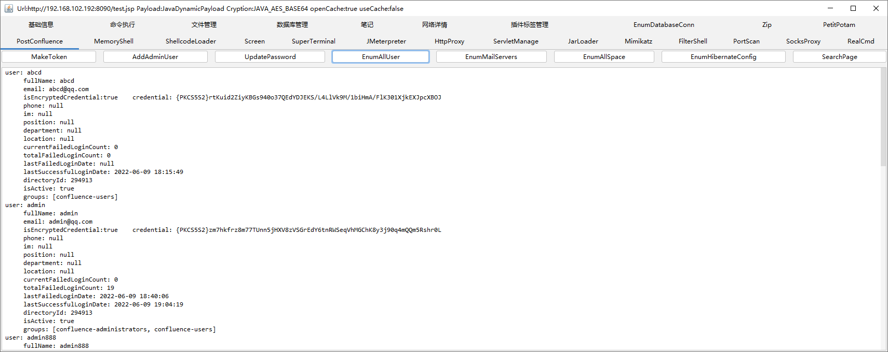
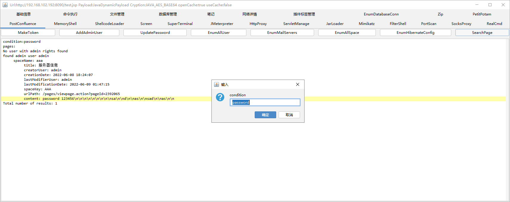

# PostConfluence
哥斯拉Confluence后渗透插件  MakeToken SearchPage  ListAllUser AddAdminUser ListAllPage ........

## 功能简介
当你在Confluence拥有一个哥斯拉webshell之后，你就可以使用哥斯拉的Confluence后渗透插件

1. MakeToken
   1. 不需要密码登录任意用户 使用场景:sso/目标有严格的认证机制
2. AddAdminUser
   1. 添加一个可登录管理员用户
3. UpdatePassword
   1. 修改任意用户的密码
4. EnumAllUser
   1. 枚举所有的用户 包括用户名,用户密码,用户手机号,用户IM账号,用户所在地址,用户所在部门,用户主页,用户当前登录失败次数,用户总登录失败次数,用户上次登录失败时间,用户上次登录成功时间,用户所在域,用户是否存活,用户所在组
5. EnumMailServers
   1. 枚举所有的邮箱配置 包括邮箱地址,邮箱账号,邮箱密码,socks代理地址
6. EnumAllSpace
   1. 枚举该Confluence所有的空间 包括该空间存在哪些文章,文章附件、文章评论数量、文章访问URL、附件下载URL、文件创建人、文章修改人、文章创建时间、文章修改时间等
7. EnumHibernateConfig
   1. 枚举Confluence的数据库配置信息
8. SearchPage
   1. 在所有的文章搜索指定关键字

## 如何使用

在https://github.com/BeichenDream/PostConfluence/releases 下载哥斯拉插件Jar包

然后打开哥斯拉 点击配置->点击插件配置->点击添加并选择你下载的Jar包

## 部分功能演示

### MakeToken

### EnumHibernateConfig

### EnumAllUser

### searchPage

